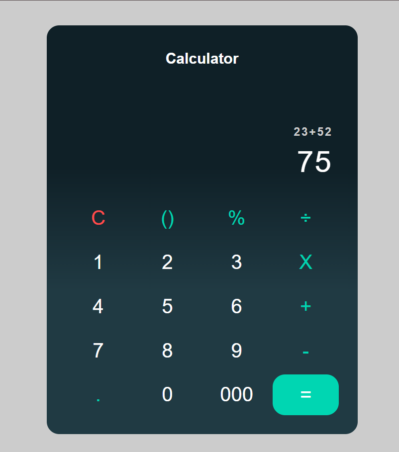

Calculator App
This is a simple calculator made with JavaScript, HTML, and CSS. You can do basic math like add, subtract, multiply, divide, and find the remainder (%).

What it does
1. You click the buttons to type numbers and math signs.
2. It shows what you typed on the screen.
3. When you press the equals button, it calculates and shows the answer.
4. You can clear everything with the clear button.

What I learned
- How to write my own logic to do calculations by breaking the problem into parts.
- Using async and await in JavaScript, which helps with handling tasks step by step.
- How to create functions to keep code organized and easy to understand.
- How to work with strings to get numbers and operators from the input.

  
